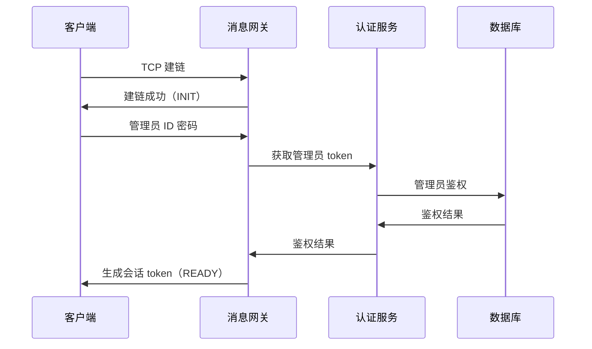

# 初始化及登录

该模块实现客户端与服务端的建链以及用户登录认证功能。

## 建链流程

客户端通过 TCP 与服务端建立连接后，客户端连接此时的状态为 `INIT` 表示准备好接收客户端数据。

所有客户端与服务端建链，首先都要通过管理员 ID 和密码向服务端获取会话 token，客户端在会话 token 过期前需要重新发送管理员 ID 和密码重新获取。

客户端与服务端建链，如果超过 30 秒为发送认证消息，服务端将主动与客户端断链。

成功建链后，客户端的所有消息都要携带会话 token，如果服务端验证 token 过期/失败，直接丢弃该消息。如果 token 验证连续失败次数超过 3 次，服务端将主动与客户端断链。

