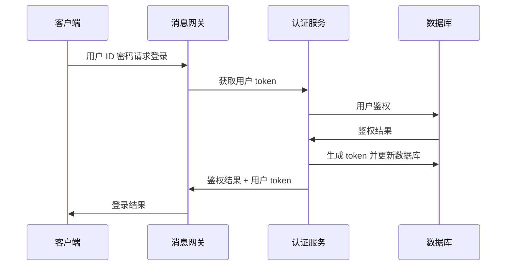

# 初始化及登录

认证模块实现客户端与服务端的建链以及用户登录认证功能。

[TOC]

## 建链流程

客户端与服务端的具体建链流程如下：

1. 客户端通过 TCP 与服务端建立连接后，客户端连接此时的状态为 `INIT` 表示已经建链完成。
2. 客户端发送 `HELLO` 报文，服务端收到报文后认为链接初始化完成，状态为 `READY` 可以接收登录请求。
3. 消息网关的会话管理将客户端保存进未认证会话链中，等待用户登录认证成功后移除。

客户端成功链接后开始每 30 秒向服务端发送心跳包：

- 服务端如果超过 60 秒没有收到客户端发送的心跳包，则主动断开客户端链接。
- 如果超过 5 分钟客户端没有进行用户登录操作，服务端同样主动释放客户端链接。

客户端建链成功可以收到服务端推送的广播消息，注意不要推送与用户相关的敏感内容。

`HELLO` 请求方法为：`gateway.hello`

报文示例：

```json
{
  "requestID": "123456789012",
  "timestamp": 1692345678,
  "platform": "1",
}
```

服务端如果超过最大建链个数，将给客户端回应错误原因。服务端响应报文如下：

```json
{
  "code": "1001",	//错误码
  "message": "错误描述",
  "details": "详细信息", //可选，用于调试
  "data": {}	//附加数据
}
```

## 用户登录

客户端建链成功后，如果 5 分钟内没有进行用户登录，服务端会主动向客户端断链，此时客户端等待 1 分钟后重新建链，或在用户登录时重新建链。



用户认证成功后：

1. 客户端的所有消息都要携带会话 token，如果服务端验证 token 过期/失败，直接丢弃该消息。
2. 客户端应该在 token 过期前的 30 秒内重新获取。
3. 如果 token 验证连续失败次数超过 3 次，服务端将主动与客户端断链。

用户认证请求方法为 `user.auth`，请求示例：

```json
{
  "requestID": "123456789012",
  "userID": "imAdmin",
  "secret": "openIM123"
}
```

用户登录成功，服务端将携带用户 token 给客户端，后续客户端请求用户相关信息等请求必须携带该 token，否则请求消息将被丢弃。

```json
{
  "code": "0",
  "message": "",
  "details": "",
  "data": {
    "token": "user_token"
  }
}
```

## 用户注册

用户注册请求方法为 `user.register`，请求报文如下：

```json
{
  "requestID": "123456789012",
  "userID": "00000001",
  "nickName": "nick",
  "faceURL": "local:///imgpath"
}
```

